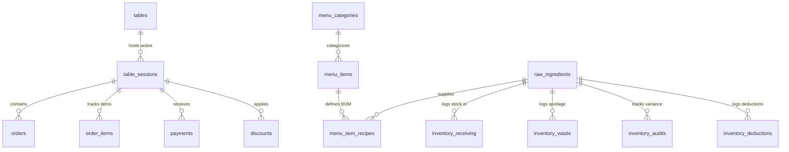

# 📖 Skylight Village Restaurant, Kitchen, Lounge & Event POS System

> **Repository Name**: `Nicolanasr/Skylightvillage-kitchen`  
> **Framework**: Next.js 16 (App Router with Turbopack), React 19, Neon PostgreSQL Serverless, Vanilla CSS + Tailwind CSS  

---

## 🚀 Quick Start & Development

### 1. Installation & Setup
```bash
# Install dependencies
npm install

# Run development server
npm run dev

# Production Build Verification
npm run build
```

---

## 📑 Comprehensive System Architecture & Feature Specification

### 1. Executive Summary & Technology Stack

**Skylight Village POS** is an enterprise-grade, real-time Point of Sale, Kitchen Display System (KDS), Event Voucher Terminal, and Recipe Portion Inventory Management system tailored for high-volume Lebanese restaurants, lounges, and event venues.

#### Core Technology Stack:
- **Framework**: Next.js 16.2 (App Router with Turbopack) & React 19.
- **Database**: Serverless Neon PostgreSQL Pool (`@neondatabase/serverless`).
- **Styling**: Modern Vanilla CSS + Tailwind CSS utilities with Glassmorphism aesthetic.
- **State Management & Real-time**: Custom polling hooks (`useRealtimePOS`) with Next.js Server Actions.
- **Printing**: Thermal CSS page-break print engine (`@media print`, `page-break-after: always`).
- **Icons**: Lucide React icons.

---

### 2. Database Schema & Architecture Data Model

The application uses 16 interconnected Neon PostgreSQL tables defined in `schema.sql`:



#### Table Specifications:

1. **`tables`**: Table matrix (`id`, `table_number`, `qr_code_token`, `status: available | occupied | merged | bill_requested`).
2. **`table_sessions`**: Active table visits (`id`, `primary_table_id`, `merged_table_ids`, `status: active | closed`, `order_type: dine_in | takeout | camping | event_voucher`, `customer_name`, `customer_phone`, `closed_at`).
3. **`menu_categories`**: Category navigation (`id`, `name`, `sort_order`).
4. **`menu_items`**: Menu catalog (`id`, `category_id`, `name`, `description`, `price_usd`, `image_url`, `station`, `available`, `is_staff_only`, `sort_order`, `is_bestseller`, `modifier_groups`).
5. **`orders`**: Order grouping header (`id`, `session_id`, `created_at`).
6. **`order_items`**: Individual dish items (`id`, `order_id`, `session_id`, `table_number`, `menu_item_id`, `item_name`, `quantity`, `unit_price_usd`, `station`, `status: pending | preparing | ready | delivered | cancelled`, `selected_modifiers`, `special_notes`, `is_comped`, `is_paid`, `is_printed`).
7. **`payments`**: Payment transactions (`id`, `session_id`, `amount_usd`, `payment_method: cash | lbp | card`, `created_at`).
8. **`discounts`**: Discount adjustments (`id`, `session_id`, `type: percentage | fixed`, `value`, `reason`).
9. **`staff_members`**: Staff authentication (`id`, `name`, `pin_code`, `role: Admin | Waiter | Kitchen | Cashier`, `created_at`).
10. **`service_calls`**: Customer call alerts (`id`, `session_id`, `table_number`, `type: waiter | charcoal | bill`, `status: pending | resolved`).
11. **`raw_ingredients`**: Inventory stock (`id`, `name`, `category`, `unit: kg | g | pcs | liter | ml | pack`, `current_stock`, `reorder_level`, `cost_per_unit_usd`).
12. **`menu_item_recipes`**: Bill of Materials recipes (`id`, `menu_item_id`, `ingredient_id`, `quantity_required`, `unit`).
13. **`inventory_receiving`**: Supplier stock-in log (`id`, `ingredient_id`, `quantity_added`, `unit_cost_usd`, `supplier_name`, `notes`).
14. **`inventory_waste`**: Spoilage loss log (`id`, `ingredient_id`, `quantity_wasted`, `total_cost_usd`, `reason`, `logged_by`).
15. **`inventory_audits`**: Physical audit counts (`id`, `ingredient_id`, `expected_stock`, `actual_stock`, `variance`, `notes`).
16. **`inventory_deductions`**: Real-time sales stock deduction audit log (`id`, `order_reference`, `dish_name`, `ingredient_id`, `ingredient_name`, `quantity_deducted`, `unit`, `remaining_stock`).

---

### 3. Detailed Application Modules & Features

#### 3.1 🖥️ POS Waiter Terminal (`/pos`)
- **Interactive Floor Plan**: Grid layout of table cards displaying real-time status badges (`Available`, `Occupied`, `Bill Requested`, `Merged`).
- **Table Merging & Unmerging**: Join multiple physical tables under 1 primary session for large group parties.
- **Seat / Guest Line-Item Tagging**: Tag items per guest (e.g. `Guest #1: Tawook`, `Guest #2: Kafta`) for seamless split checks.
- **Multi-Currency Settlement**: Fixed exchange rate at **89,500 LBP / USD**. Displays bill total in both `$ USD` and `LBP`. Supports dual cash (`USD` + `LBP`) and credit card payments.
- **Item Comping & Discounts**: Mark items as `🎁 Comped (Free)` or apply percentage/fixed dollar discounts.
- **Thermal Invoice Receipt Printer**: Formatted print receipt layout with barcode/invoice reference, tax break, and payment breakdown.

---

#### 3.2 👨‍🍳 Kitchen Display System KDS (`/kds`)
- **Station-Filtered Dispatch**: Filter live orders by kitchen station (`mezza`, `sajj`, `grill`, `subs_sandwiches`, `bar`, `shisha`).
- **Interactive Lifecycle Buttons**:
  - `pending` -> Tap to start `preparing`.
  - `preparing` -> Tap when `ready`.
  - `ready` -> Waiter delivers to table (`delivered`).
- **Audio Chime Alerts**: Web Audio API sound alerts when new pending items arrive at the station.
- **Merged Table Display**: Displays clear table labels (e.g. `TABLE #3 & #4 (Merged)`).

---

#### 3.3 🎟️ Event Voucher Terminal (`/events`)
- **PIN Auth Protection**: Wrapped with `<StaffAuthGuard pageTitle="Event Voucher Terminal">` requiring staff PIN.
- **Rapid Voucher Issuance**: Enter customer name / ticket tag (e.g. `EVT-101`), select items, choose payment method, and submit in 1 click.
- **Last-Added-First Cart**: Cart entries ordered descending by `addedAt` timestamp so last added items show at top.
- **Station-Grouped Thermal Chit Printing**:
  - **Rule**: Groups printed voucher tickets **strictly by station**. If an order contains 2 items from BBQ and 1 item from Sajj, the printer outputs **1 chit paper for BBQ** (with 2 line items) and **1 chit paper for Sajj**.
  - **CSS Rule**: Enforces paper cut using `.voucher-ticket { page-break-after: always !important; break-after: page !important; }`.

---

#### 3.4 📦 Enterprise Recipe BOM & Portion Inventory System (`/admin/inventory`)
- **Direct Route & Query Sync**: Dedicated route `/admin/inventory` with URL query state persistence (`/admin/inventory?sub=recipes`, `/admin/inventory?sub=deductions`).
- **Raw Ingredients Library**: Track stock counts in `kg`, `g`, `pcs`, `liter`, `ml` with reorder alert thresholds and unit costs.
- **Recipe BOM & Food Costing (COGS)**:
  - Link dishes to portion gram weights (e.g. `130g Tawook`, `30g Garlic Mayo`, `1 pc Bread`, `100g Fries`).
  - **Gross Profit Margin % Calculator**: Calculates recipe cost vs menu selling price in real-time.
  - **Optional Stock Items**: Menu items can have `0 stock items` by default (no forced dummy recipes).
- **Fast Interactive Dish Search**: Search input with live dish cards showing price and ingredient count badges.
- **Real-Time Live Order Stock Auto-Deduction**:
  - Automatically deducts portion weights on POS, Takeout, QR, and Event Voucher orders.
  - **Auto Out-of-Stock Locking**: Automatically locks dishes as `Out of Stock` (`available = false`) when any required raw ingredient hits `0`.
- **Automatic Cancellation Restocking**:
  - When an order item is cancelled or voided (`status = 'cancelled'`), raw ingredient portion weights are **automatically refunded** back into stock.
  - Re-enables linked menu items (`available = true`) if stock rises back above 0.
- **Grouped Sales Deduction Log Feed**:
  - Summarizes deductions **1 single line per transaction**.
  - Includes collapsible `[👁️ View Details]` drawers showing full ingredient subtractions and remaining stock.
- **Supplier Receiving (Stock In)**: Log supplier delivery quantities and update average unit costs.
- **Kitchen Waste & Spoilage Log**: Log spoiled or dropped ingredients with financial loss calculations.
- **Weekly Stock Variance Audit**: Compare system expected stock vs physical count with shortage/surplus badges.

---

#### 3.5 🛍️ Takeout & Camping Workbench (`/takeout`)
- Dedicated phone order workbench for takeout & camping reservations.
- Customer phone number lookup to resume active open orders.

---

#### 3.6 📱 Customer QR Code Ordering (`/order` & `/qr`)
- Contactless table ordering interface validated by table QR token.
- Customers select item modifiers and special instructions.
- Digital service call buttons (`Call Waiter`, `Request Charcoal`, `Request Bill`).

---

#### 3.7 🛡️ Admin Portal & Odoo Analytics (`/admin`)
- **Menu Catalog Manager**: Add, edit, sort, toggle bestsellers, or hide staff-only dishes.
- **Menu Categories Manager**: Reorder and create menu categories with non-scrollable `flex-wrap` navigation bar.
- **Tables & QR Generator**: Create tables and generate downloadable QR code tokens.
- **Staff Roster & PIN Codes**: Manage staff accounts and 4-digit PIN access.
- **Order History & Invoices**: Search past closed table sessions, view item breakdowns, and issue refunds.
- **Odoo Analytics Reports**: Export Odoo-compatible CSV reports, status transition logs, and financial totals.

---

### 4. Key Business Rules & Architectural Constraints

1. **Fixed Exchange Rate**: LBP exchange rate is locked to **89,500 LBP / 1 USD** across all calculations (`calculateBillTotals`).
2. **Station-Grouped Thermal Chits**: Event vouchers MUST group line items by station onto 1 chit paper per station separated by page breaks (`page-break-after: always`).
3. **PIN Security**: Restricted routes (`/admin`, `/events`) enforce `<StaffAuthGuard>` authentication.
4. **Cart Timestamp Ordering**: Cart items in Event Terminal render in descending order (`addedAt` timestamp).
5. **No Placeholders**: All database entities use production seed data or live queries; zero synthetic mock wrappers.
6. **Zero Error Build Standard**: Production build must compile cleanly via `npm run build`.

---

### 5. File Structure Reference

```
SKylight Kitchen/
├── schema.sql                         # PostgreSQL Master DDL Schema Definition
├── README.md                          # Master Project & AI Documentation
├── src/
│   ├── app/
│   │   ├── actions/
│   │   │   ├── admin-actions.ts       # Menu, category, staff & DB seed actions
│   │   │   ├── audit-actions.ts       # Staff activity audit logs
│   │   │   ├── inventory-actions.ts   # Recipe BOM, stock deduction & restock actions
│   │   │   ├── order-actions.ts       # POS, KDS & Event Voucher order submission
│   │   │   ├── payment-actions.ts     # POS checkout, item cancel & restock triggers
│   │   │   └── report-actions.ts      # Odoo CSV exports & status transition logs
│   │   ├── admin/
│   │   │   ├── page.tsx               # Main Admin Portal Hub
│   │   │   └── inventory/page.tsx     # Direct URL Route for Recipe BOM & Inventory
│   │   ├── events/page.tsx            # Event Voucher Terminal
│   │   ├── kds/page.tsx               # Kitchen Display System Terminal
│   │   ├── order/page.tsx             # Customer QR Code Self-Ordering Page
│   │   ├── pos/
│   │   │   ├── page.tsx               # POS Waiter Terminal Page
│   │   │   └── reports/page.tsx       # End-of-day financial reports
│   │   ├── qr/page.tsx                # QR Code Generator Page
│   │   └── takeout/page.tsx           # Takeout & Phone Order Workbench
│   ├── components/
│   │   ├── admin/
│   │   │   ├── AdminHeader.tsx        # Admin top navigation header
│   │   │   ├── AdminInventoryManager.tsx # Multi-tab Recipe BOM & Inventory Hub
│   │   │   ├── AdminMenuManager.tsx   # Menu item catalog editor
│   │   │   └── OdooAnalyticsReports.tsx # Financial & status reports
│   │   ├── auth/
│   │   │   └── staff-auth-guard.tsx   # PIN Code Protection Guard
│   │   ├── kds/
│   │   │   └── KDSCard.tsx            # Kitchen order card component
│   │   └── pos/
│   │       ├── POSCartPanel.tsx       # Waiter cart & settlement panel
│   │       ├── POSMenuGrid.tsx        # POS non-scrollable category menu grid
│   │       └── invoice-receipt.tsx    # Thermal receipt print component
│   └── lib/
│       ├── currency.ts                # Usd/Lbp conversion & bill totals logic
│       ├── db.ts                      # Serverless Neon Pool Database connection
│       └── types.ts                   # Master TypeScript Interfaces & Types
```
